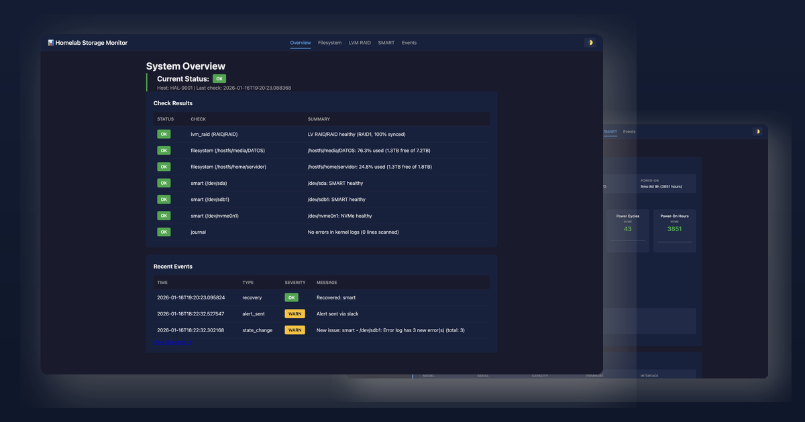

<p align="center">
  
</p>

<h1 align="center">Homelab Storage Monitor</h1>

<p align="center">
  <a href="#-quick-start">Quick Start</a> •
  <a href="#-features">Features</a> •
  <a href="#%EF%B8%8F-configuration">Configuration</a> •
  <a href="#-api-reference">API</a> •
  <a href="#-troubleshooting">Troubleshooting</a>
</p>

<p align="center">
  <a href="https://github.com/Korrd/alertr/actions/workflows/ci.yml"></a>
  <a href="https://github.com/Korrd/alertr/releases"></a>
  <a href="LICENSE"></a>
  <a href="https://github.com/Korrd/alertr/pkgs/container/alertr"></a>
</p>

<p align="center">
  Proactive storage monitoring for your homelab.<br>
  Detects disk failures, RAID degradation, and filesystem issues<br>
  before they become catastrophic data loss.
</p>

<p align="center">
  
</p>

<br>

## ✨ Features

### 🔍 Comprehensive Health Checks
- **LVM RAID1 Monitoring** – Detect mirror degradation, sync issues, and stalled rebuilds
- **SMART Health Checks** – Monitor disk health attributes with delta detection for ATA and NVMe drives
- **Self-Test Results** – Display SMART self-test history and detailed error logs
- **Filesystem Capacity** – Track usage with configurable warning/critical thresholds
- **Kernel Log Scanning** – Detect I/O errors, ext4 errors, and SATA issues

### 🚨 Smart Alerting
- **Deduplicated Alerts** – No alert fatigue with configurable cooldown periods
- **Multi-Channel** – Slack and email notifications with impact descriptions
- **Recovery Notifications** – Know when issues resolve themselves
- **Error Acknowledgment** – Suppress known issues with notes and audit trail

### 📊 Web Dashboard
- **Real-time Status** – At-a-glance system health overview
- **Historical Charts** – Track trends over time
- **Event Timeline** – Complete audit trail of all events
- **Dark/Light/Auto Theme** – Easy on the eyes, any time of day
- **Mobile Responsive** – Check on your storage from anywhere

### 🏠 Homelab Friendly
- **Simple Backup** – Single SQLite database file
- **Low Resource Usage** – Designed for always-on home servers
- **Docker Ready** – Two-container architecture for security
- **Easy Configuration** – Single YAML config file

<br>

## 🚀 Quick Start

<details>
<summary><strong>1. Clone and Configure</strong></summary>
<br>

```bash
git clone https://github.com/Korrd/alertr.git
cd alertr

# Create config directory and copy example
mkdir -p config data
cp config/config.example.yaml config/config.yaml

# Set proper permissions for the dashboard container
sudo chown -R 1000:1000 ./data

# Edit configuration for your setup
nano config/config.yaml
```

</details>

<details>
<summary><strong>2. Configure Monitored Filesystems</strong></summary>
<br>

Edit `docker-compose.yml` to add bind mounts for filesystems you want to monitor:

```yaml
volumes:
  # ... existing mounts ...

  # Add your monitored filesystems
  - /media/DATOS:/hostfs/media/DATOS:ro
  - /mnt/storage:/hostfs/mnt/storage:ro
```

Then in `config/config.yaml`:

```yaml
filesystem:
  mountpoints:
    - path: /hostfs/media/DATOS
      warn_pct: 85
      crit_pct: 95
```

</details>

<details>
<summary><strong>3. Configure Disks for SMART Monitoring</strong></summary>
<br>

```yaml
smart:
  disks:
    - /dev/sda
    - /dev/sdb
    - /dev/nvme0
```

</details>

<details>
<summary><strong>4. Start Services</strong></summary>
<br>

```bash
# Copy the example compose file
cp docker-compose.example.yml docker-compose.yml

# Start services
docker-compose up -d
```

</details>

<details>
<summary><strong>5. Access Dashboard</strong></summary>
<br>

Open http://your-server:8088 in your browser.

</details>

<br>

## 🏗️ Architecture

Two-container model for security:

```
┌─────────────────┐     ┌─────────────────┐
│    Collector    │     │    Dashboard    │
│   (privileged)  │     │  (unprivileged) │
│                 │     │                 │
│  • LVM checks   │     │  • FastAPI      │
│  • SMART checks │     │  • Charts       │
│  • Log scanning │     │  • API          │
│  • Alerting     │     │  • ACK system   │
└────────┬────────┘     └────────┬────────┘
         │                       │
         │    ┌──────────────┐   │
         └───►│  SQLite DB   │◄──┘
              │ (hsm.sqlite) │
              └──────────────┘
```

<details>
<summary><strong>Host Mounts Explained</strong></summary>
<br>

The collector container requires several host mounts:

| Mount | Purpose |
|-------|---------|
| `/dev` | Access to disk devices for SMART checks |
| `/run/lvm`, `/etc/lvm` | LVM metadata and runtime |
| `/run/udev` | Device information |
| `/run/log/journal` | Journald logs for error scanning |
| `/etc/machine-id` | Required for journald access |
| `/hostfs/*` | Bind-mounted filesystems to monitor |

</details>

<br>

## ⚙️ Configuration

Configuration is done through a single YAML file. See [config/config.example.yaml](config/config.example.yaml) for full documentation.

<details>
<summary><strong>Preview key settings</strong></summary>
<br>

```yaml
# Check interval
scheduler:
  interval_seconds: 900  # 15 minutes

# Alert deduplication
alerts:
  dedupe_cooldown_seconds: 21600  # 6 hours between repeated alerts
  send_recovery: true              # Notify when issues resolve

# Data retention
history:
  retention_days_metrics: 90
  retention_days_events: 180
```

</details>

<br>

## 💻 CLI Commands

<details>
<summary><strong>View all commands</strong></summary>
<br>

```bash
# Run checks once
hsm run --config /path/to/config.yaml

# Run checks in loop mode (for collector)
hsm run --config /path/to/config.yaml --loop

# Start dashboard server
hsm serve --config /path/to/config.yaml --bind 0.0.0.0:8088

# Show current status
hsm status --config /path/to/config.yaml

# Test alerting
hsm test-alerts --config /path/to/config.yaml --slack --email

# Run database migrations
hsm migrate-db --config /path/to/config.yaml

# Clean up old data
hsm retention --config /path/to/config.yaml --vacuum
```

</details>

<br>

## 🔌 API Reference

<details>
<summary><strong>Dashboard Pages</strong></summary>
<br>

| Endpoint | Description |
|----------|-------------|
| `GET /` | Dashboard overview |
| `GET /filesystem` | Filesystem status page |
| `GET /lvm` | LVM RAID status page |
| `GET /smart` | SMART disk health page |
| `GET /events` | Event timeline |

</details>

<details>
<summary><strong>REST API Endpoints</strong></summary>
<br>

| Endpoint | Description |
|----------|-------------|
| `GET /api/status/current` | Current status JSON |
| `GET /api/runs?limit=50` | Recent check runs |
| `GET /api/metrics?name=...` | Query metrics |
| `GET /api/events?severity=...` | Query events |
| `GET /api/issues/open` | Open issues |
| `GET /api/smart/acknowledgments` | List all SMART acknowledgments |
| `POST /api/smart/acknowledge` | Acknowledge SMART errors for a disk |
| `DELETE /api/smart/acknowledge/{disk}` | Remove acknowledgment for a disk |
| `GET /health` | Health check (no auth) |

</details>

<br>

## 🔕 Error Acknowledgment

When a disk has SMART warnings that you've investigated and want to suppress from alerts:

1. Navigate to the **SMART** page in the dashboard
2. Click the **Acknowledge** button on the disk card
3. Enter a note explaining why (e.g., *"Replacement scheduled for next week"*)
4. Click **Acknowledge**

**Acknowledged disks:**
- Show a muted status (grey) on the overview page
- Are excluded from Slack/email alerts
- Still display raw data on the SMART page
- Trigger a Slack notification when acknowledged

<br>

## 🔐 Authentication

<details>
<summary><strong>Password Authentication</strong></summary>
<br>

```yaml
dashboard:
  auth_enabled: true
  auth_username: admin
  auth_password: your-secure-password
```

</details>

<details>
<summary><strong>Bearer Token Authentication</strong></summary>
<br>

```yaml
dashboard:
  auth_enabled: true
  auth_token: your-secret-token
```

Use the token as the password with any username.

</details>

<br>

## 💾 Backup and Restore

The entire state lives in a single SQLite file—easy to backup, easy to restore.

<details>
<summary><strong>Backup</strong></summary>
<br>

```bash
# Stop collector to ensure consistency
docker-compose stop hsm_collector

# Copy database
cp data/hsm.sqlite /backup/hsm-$(date +%Y%m%d).sqlite

# Restart collector
docker-compose start hsm_collector
```

</details>

<details>
<summary><strong>Restore</strong></summary>
<br>

```bash
docker-compose stop hsm_collector hsm_dashboard
cp /backup/hsm-20240115.sqlite data/hsm.sqlite
docker-compose up -d
```

</details>

<br>

## ➕ Adding New Disks or Mountpoints

<details>
<summary><strong>Step-by-step guide</strong></summary>
<br>

1. **Stop the collector:**
   ```bash
   docker-compose stop hsm_collector
   ```

2. **Edit `config/config.yaml`:**
   ```yaml
   smart:
     disks:
       - /dev/sda
       - /dev/sdb
       - /dev/sdc  # New disk

   filesystem:
     mountpoints:
       - path: /hostfs/media/DATOS
       - path: /hostfs/mnt/newdrive  # New mount
   ```

3. **If adding a new mountpoint, update `docker-compose.yml`:**
   ```yaml
   volumes:
     - /mnt/newdrive:/hostfs/mnt/newdrive:ro
   ```

4. **Restart:**
   ```bash
   docker-compose up -d
   ```

</details>

<br>

## 🔧 Troubleshooting

<details>
<summary><strong>Journald Access Issues</strong></summary>
<br>

If journald logs aren't accessible in the container:

1. Check that journal files exist on host:
   ```bash
   ls -la /run/log/journal/
   ```

2. If using fallback log scanning:
   ```yaml
   journal:
     use_journald: false
     fallback_log_paths:
       - /var/log/kern.log
   ```

   And mount the log files:
   ```yaml
   volumes:
     - /var/log:/var/log:ro
   ```

</details>

<details>
<summary><strong>LVM Not Detected</strong></summary>
<br>

Ensure LVM runtime is mounted:

```yaml
volumes:
  - /run/lvm:/run/lvm:rw
  - /etc/lvm:/etc/lvm:ro
```

</details>

<details>
<summary><strong>SMART Access Denied</strong></summary>
<br>

The collector must run with `privileged: true` for SMART access.

</details>

<details>
<summary><strong>Dashboard Shows No Data</strong></summary>
<br>

1. Check collector logs:
   ```bash
   docker-compose logs hsm_collector
   ```

2. Verify database exists:
   ```bash
   ls -la data/hsm.sqlite
   ```

3. Check database permissions match dashboard user:
   ```bash
   sudo chown -R 1000:1000 ./data
   ```

</details>

<details>
<summary><strong>Readonly Database Errors</strong></summary>
<br>

The dashboard needs write access for the acknowledgment system. Fix permissions:

```bash
sudo chown -R 1000:1000 ./data
```

</details>

<br>

## 🛠️ Development

<details>
<summary><strong>Local Setup</strong></summary>
<br>

```bash
# Create virtual environment
python -m venv venv
source venv/bin/activate

# Install with dev dependencies
pip install -e ".[dev]"

# Run tests
pytest -v

# Run linting
ruff check .
```

</details>

<details>
<summary><strong>Building Docker Image Locally</strong></summary>
<br>

```bash
# Build the image
docker build -t homelab-storage-monitor:local .

# Update docker-compose.yml to use local image
# image: homelab-storage-monitor:local
```

</details>

<details>
<summary><strong>Running Locally</strong></summary>
<br>

```bash
# Create test config
cp config/config.example.yaml config.yaml

# Run single check
hsm run -c config.yaml

# Start dashboard
hsm serve -c config.yaml --bind 127.0.0.1:8088

# Test alerts
hsm test-alerts -c config.yaml --slack --email
```

</details>

<br>

## 📄 License

Business Source License 1.1 with a change date of 2029-01-16, after which the project reverts to Apache 2.0.

- ✅ **Allowed**: Non-production and non-commercial use
- 📧 **Commercial use**: Contact the authors for licensing

Full terms in [LICENSE](LICENSE).
